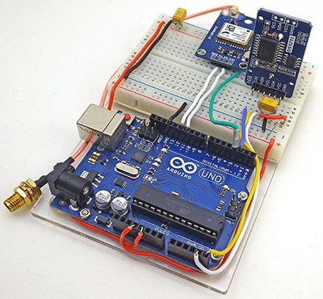

# DS3231-utilities

<figure></figure>
Various utility programs for TimeSync to GPS, Adjusting Age Register, etc. Some of the programs here are based on the work of others, with attributution and links to the original sources. The versions here have been tweaked where necessary to work with the UNO - NEO6m GPS combination in the photo. 
 

For description of how I use these utilities see the blog post at: 
[Setting Accurate RTC time with a GPS](https://thecavepearlproject.org/2024/10/22/setting-accurate-rtc-time-with-a-gps-the-ds3231-aging-offset-to-reduce-drift/)
 

These program support an ongoing series of DIY 'Classroom Logger' tutorials from Edward Mallon & Dr. Patricia Beddows at the Cave Pearl Project. The idea is to provide a starting point for student projects in environmental monitoring courses and/or thesis level research. [link to Project Blog](https://thecavepearlproject.org/) 
